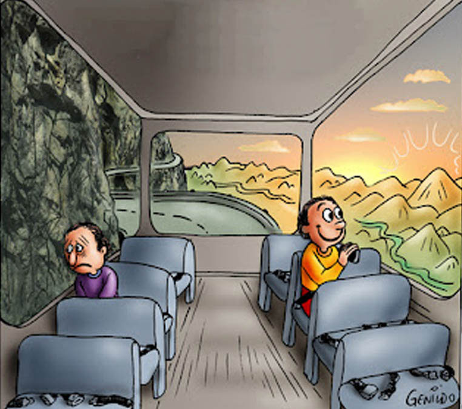

# ViewFinder

*Copyright: Genildo Ronchi*

A service that can estimate the best side to sit on, given any route, so you get the best views.

# Feature ideas

- Works for any land-based type of transportation (trains, buses, …)
- Estimates an overall recommendation and a detailed analysis for every section of the route
- Gives a short summary of the most interesting things to see along the route
- Takes multiple factors into account (such as elevation, water, …)
- User customizable preferences
- API for easy integration with trip routing services
- Web-based UI
- Pre-calculated estimates for an overview map that shows the most scenic train routes and the side you should sit on
- Takes into account direction changes of trains

# What makes a view scenic?

## Research

Let’s start by looking at the most beautiful train journeys in the world and identifying what makes them scenic.

- Visp-Zermatt
    - View most beautiful depending on the side of the valley the train runs on
- Albula line
    - Landwasser viaduct most important landmark, is preceded by track curve where you should sit on the inner side of the curve
    - Many spiral tracks, where there is no clear better side because the train reverses direction
- Bernina line
    - Train runs alongside lake
    - View of big mountains
    - Descend at Alp Grüm has best views of the valley at higher altitudes
    - Circular viaduct is most scenic on the inside of the curve
- West Highland line
    - Train runs in valley and along Lochs
    - Glenfinnan Viaduct most scenic on the inner side of the curve
- Nova Gorica - Jesenice
    - Train runs in valley along river
- Cannes - Menton
    - Most scenic when sitting on the side of the Mediterranean
- Bergensbanen
    - Views of the Fjord
    - Lakes/Valleys
- Inlandabanan
    - Runs mainly through woods, no clear better side
- Centovalli line
    - Valleys and lake
    - Beautiful views of Intragna in curve with viaduct
- Golden Pass
    - Best views on descent to Lake Geneva
- Tokaido Shinkansen
    - Most scenic view is of Mount Fuji

## Main factors

Based on the reseach, I identified the following main factors that decide how scenic a route is.

### Factor 1: Elevation left and right of the route

Scenic routes often run alongside hills, where the elevation is usually falling on one side and rising on the other side. In this case it is preferable to sit on the side of the falling elevation, because it enables a high visibility, whereas the other side does not because you are looking at terrain. The larger the drop in elevation, the more beautiful the view is. This can also be expressed in another way: how much area is visible and how far you can see.

### Factor 2: Large mountains

Large mountains can make very scenic views. There can by falling elevation in front of the mountain, a valley, which makes the view even more picturesque. This can be measured by the difference in elevation and the highest elevation in the field of view.

### Factor 3: Bodies of water

When trains run next to water (rivers, lakes or the sea), it is usually preferable to sit on the side of the water. The bigger the body of water, the more scenic the view is. You can also extend this to other land cover types, like forest or grassland.

### Factor 4: Important landmarks

Important landmarks like castles provide pretty views.

### Factor 5: Bridges in combination with curves

On straight tracks bridges are usually not visible, however, when there are curves in the vicinity, the bridge itself (and the vehicle on the bridge, depending on vehicle set length) can be visible on the inner side of the curve.

### Factor 6: Being able to see the line you just travelled on

U-turns and circular tracks enable views of the line you just travelled on, with the possibility of seeing other trains.

### Factor 7: Parallel lines

Two lines running in parallel might enable views of trains running side by side in the same direction.

## Calculation method

The end goal is to produce a binary output (left or right) for an entire route. Because there are multiple factors that determine how nice a view is and many different views along the route, there have to be weights that affect how much each individual component affects the end result.

$S : \text{Scenicness} \\
i : \text{Factor},i \in \{1,2,3,\ldots\}\\
w_i : \text{Factor weight} \\
p : \text{Point along the route} \\
s : \text{Side}, s \in \{L,R\} \\
s^* : \text{Optimal side}$

### Absolute scenicness

For every factor the absolute scenicness on both sides is evaluated, with 0 being not scenic at all and 1 being the most beautiful view imaginable.

$$
0 \le S_{p,s,i} \le 1
$$

### Factor weights

The absolute scenicness of each factor is multiplied by the factor weights and summed up to create a total scenicness for each side.

$$
\sum^n_{i=1} w_i = 1
$$

$$
S_{p,s} = \sum^{n}_{i=1} S_{p,s,i}w_{i}
$$

### Total scenicness

The total scenicness describes the absolute scenicness of the entire route. It is mainly determined by the best side per point along the route.

$$
S_{\text{p total}} = \max\{S_{p,L}, S_{p,R}\} - (\frac{\max\{S_{p,L}, S_{p,R}\} - \min\{S_{p,L}, S_{p,R}\}}{10})
$$

$$
S_{\text{total}} = \frac{1}{n} \sum^{n}_{p=1} S_{\text{p total}}
$$

### Relative scenicness

If the views on both sides are equally good or bad, this point on the route should not have a big influence on the total, whereas points where there is a clearly superior side should.

$$
S_{p\text{,rel}} = S_{p,R}-S_{p,L}
$$

### Optimal side

The optimal side can be determined by calculating the average of the relative scenicness, where values closer to 1 are right and values closer to -1 left.

$$
S_{\text{rel,total}} = \frac{1}{n} \sum^{n}_{p=1} S_{p\text{ rel}}
$$

$$
s^* =
\begin{cases}
L & \text{if } S_{\text{rel,total}} < 0 \\
R & \text{if } S_{\text{rel,total}} \ge 0
\end{cases}
$$

# Technical architecture

ViewFinder on a technical level consists of three components: a backend for precalculating the scenicness and querying the scenicness of a route with APIs, a database to store computed scenicness, and a frontend for users to select a route and visualize the result of the algorithm. The backend can be used standalone for integration with existing routing services.

## Backend

### Tech stack

- Python
    - FastAPI
- OSM Overpass API
- AWS Compernicus DEM 90m
- GDAL viewshed

### Precomputing scenicness

Computing the scenicness of a route on-demand is not feasable because of the large size of the DEM and the computing time needed for the line-of-sight/viewshed analysis. Therefore, an API is provided that precomputes the scenicness of all railway lines/paths in a given bounding box and saves the compiled scenicness values in a database.

These are the steps to precompute the scenicness:

1. Getting lines/paths from the OSM Overpass API
2. Sample points on the lines/path
3. Download the DEM for the bounding box
4. Run the viewshed analysis for the samples points on the DEM
5. Slice the result of the viewshed analysis in left/right of the line
6. Compute the factors for scenicness
7. Save the results to the database
8. Segment from sampled points so scenicness segments

### Line-of-sight/viewshed analysis

One step is to make a line-of-sight/viewshed analysis from points along the polyline (excluding tunnel segments) using a digital elevation model (DEM). The goal is to compute the visible area on both sides of the polyline.

[gdal_viewshed — GDAL  documentation](https://gdal.org/en/stable/programs/gdal_viewshed.html)

[r.viewshed - GRASS GIS manual](https://grass.osgeo.org/grass-stable/manuals/r.viewshed.html)

Viewshed settings

- Height of observer: 2,5 m
    - Asuming the DEM is at the height of the rail superstructure/ballast, the height of the observer consist of
        - the height of the rail (0,17 m)
        - the height from the top of the rail to the train floor (0,6 - 1,25 m, depending on the type of train)
        - the height of the eyes of a sitting person (~1,3 m)
    - That results in a value between 2,07 and 2,72 m
- Height of target: 0 m

🚧 TODO: Handle bridges

### Routing

A routing request takes the following inputs:

- Array of coordinates OR polyline (🚧 TODO: How to properly handle requests with existing polylines from routing services like MOTIS)

and produces the following output:

- Segmented polyline
    - Coordinates
    - Elevation
    - Is Tunnel
    - Is Bridge
    - Reversing/direction change

This is done using OSM.

## Database

### Tech stack

- PostgreSQL with PostGIS

## Frontend

### Tech stack

- SvelteKit
- TailwindCSS
- MapLibre